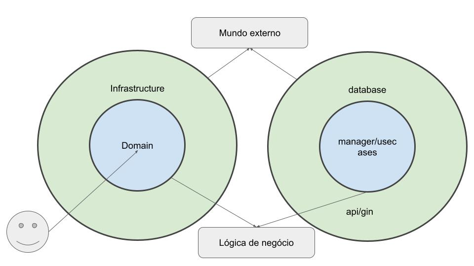

<p align="center"></p>

# zpe-project
This project aims to create a microservices ecosystem for managing user CRUD operations, accommodating various roles.

## Execution Guide

To run this code, you need to have Makefile and Docker installed on your system.
***You must have ports 3000, 8080, 8081, 8082 and 8083 free to run the APIs***

### Steps for Execution

1. Clone this repository to your local machine.

2. In the terminal, navigate to the project root directory.

3. Run the following command to launch the application:

```bash
   make dev-start-with-db
```

***Para criar um usuário no software, siga as instruções abaixo:***

1. Open the Postman.
   
2. Import the provided request collection file (postman_collection.json).


***Documentation***

The documentation has been generated using C4Builder tools. To access the documentation, simply execute the following command:

```bash
   make view-doc
```

After executing the above command, the documentation will be accessible at [http://localhost:3000](http://localhost:3000).

## Directory structure

```bash
.
|____docs
| |____docs
|____cmd
| |____executor
| | |____main.go
|____scripts
|____tests
| |____e2e
|____internal
| |____environment
| |____infrastructure
| | |____database
| | |____logger
| |____api
| | |____middlewares
| | |____routes
| |____domain
| | |____domain_app
|____docs

|
```

